# Procesverslag
Markdown is een simpele manier om HTML te schrijven.  
Markdown cheat cheet: [Hulp bij het schrijven van Markdown](https://github.com/adam-p/markdown-here/wiki/Markdown-Cheatsheet).

Nb. De standaardstructuur en de spartaanse opmaak van de README.md zijn helemaal prima. Het gaat om de inhoud van je procesverslag. Besteedt de tijd voor pracht en praal aan je website.

Nb. Door *open* toe te voegen aan een *details* element kun je deze standaard open zetten. Fijn om dat steeds voor de relevante stuk(ken) te doen.

## Jij

  
uitwerken voor kick-off werkgroep

  ### Auteur:
  Agnes Verhagen

  #### Je startniveau:
  Blauw

  #### Je focus:
  Surface plane
 

## Je website

  
uitwerken voor kick-off werkgroep

  ### Je opdracht:
  link naar de website die je gaat namaken óf de naam/omschrijving van je eigen ontwerp:
  https://www.vuecinemas.nl/?gclid=Cj0KCQiA37KbBhDgARIsAIzce15A4qu7-TlGYebF2rzYQFlZwYEjGfGIfn5NCXJKngemi1MIVp89ODsaAmpeEALw_wcB#filmposters

  #### Screenshot(s) van de eerste pagina (small screen): 
  hier de naam van de pagina: 
  https://www.vuecinemas.nl/trailers
  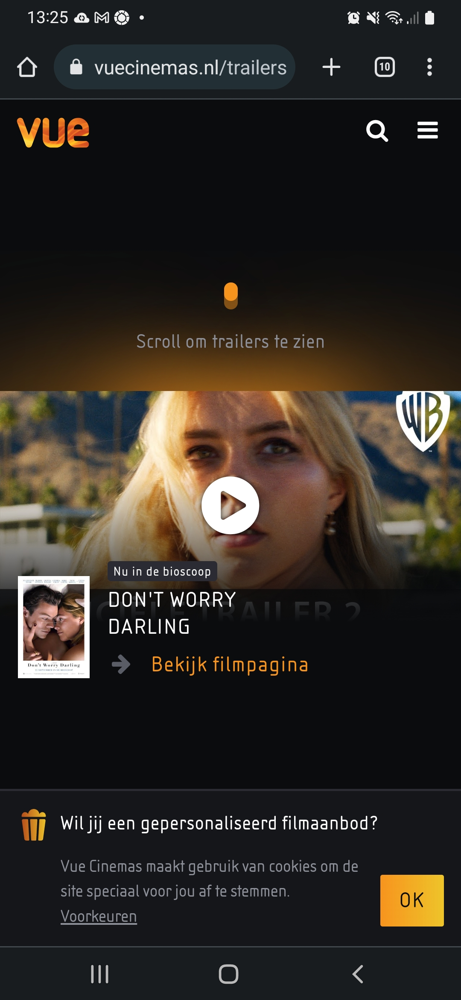

  #### Screenshot(s) van de tweede pagina (small screen):
  hier de naam van de pagina:
  https://www.vuecinemas.nl/moviepass
  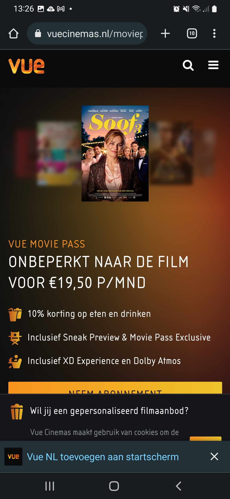
 

## Toegankelijkheidstest 1/2 (week 1)

  
uitwerken na test in 1e werkgroep

  ### Bevindingen
  Lijst met je bevindingen die in de test naar voren kwamen:
  -De koppen op de site zijn lastig te vinden met de screenreader
  -De screenreader gaat eerst naar het secundaire menu en dan naar het primaire
  -De site is bij bepaalde kleurenpaletten niet erg toegankelijk voor kleurenblinden

  #### Screenreader
  Hier korte omschrijving (met indien nodig afbeeldingen)
  
  Ik heb de screenreader training gevolgd en vervolgens heb ik de instellingen zo aangepast dat de screenreader te bedienen is met 1 knop, de capslock. Uiteindelijk begreep ik hoe de screenreader werkte, maar ik vond het veel te snel gaan.

  Hier een omschrijving van hoe het opgelost kan worden (met indien nodig afbeeldingen)

  De screenreader mag langzamer voorlezen. Verder moet ik zorgen dat alle headings enzo duidelijk zijn, in een logische volgorde.

  #### Muis en Toetsenbord 
  Hier korte omschrijving (met indien nodig afbeeldingen)

  Ik heb de Chrome extensie 'colorblindly' geinstalleerd en vervolgens heb ik alle opties op mijn gekozen site uitgeprobeerd. Ik kwam erachter dat de monochrome optie het minst toegankelijk was van alle opties. Dit komt waarschijnlijk omdat de site een zwarte achtergrond heeft. Het effect is dan dat plaatjes en grijze letters weinig/nauwelijks contrast hebben en dit maakt de content minder goed zichtbaar.

  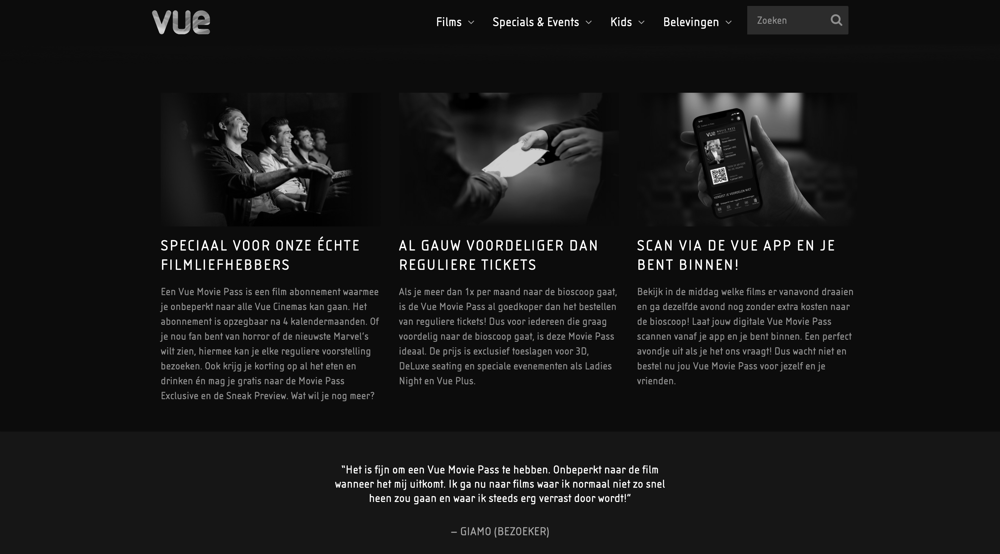

  Hier een omschrijving van hoe het opgelost kan worden (met indien nodig afbeeldingen)

  Het contrast tussen achtergrond en tekst en plaatjes moet groot genoeg zijn, dus misschien moeten de grijze letters ook wit worden.

  #### Motoriek (shocks, elastiekjes)
  Hier korte omschrijving (met indien nodig afbeeldingen)

  Ik had de shock heel kort gebruikt, maar het deed te veel pijn, dus ik kon het niet echt gebruiken. De elastiekjes had ik om meerdere vingers 
  gedaan. Ik merkte alleen niet echt verschil qua navigatie op de website, misschien omdat mijn motoriek van nature vrij goed is, of ik nou
  10 of 8 vingers heb die ik kan gebruiken.

  Hier een omschrijving van hoe het opgelost kan worden (met indien nodig afbeeldingen)
  N.V.T.

  #### Visueel (brillen, contrast, kleurenblind, dark/light). 
  Hier korte omschrijving (met indien nodig afbeeldingen)

  1 Combined Loss Diabetic Eye Disease en Central Field Loss AMD:
  ik zie alles lastig, maar ik zie alles wel.

  2 Peripheral Field Loss:
  ik zie geen dingen in mijn centrale blikveld.

  3 Low Contrast:
  ik zie plaatjes slecht en grijze tekst.

  4 Color #0779P: 
  geen verschil, alles is wat geler, goed contrast met zwart, grijze tekst lijkt zelfs beter leesbaar

  5 Hemifield loss: 
  ik merk geen verschil met normale situatie, ik zie niet minder dan normaal

  -Ballon omhoog houden terwijl ik de navigeer door de pagina heen: (voor mensen met adhd) gaat lastig

  Hier een omschrijving van hoe het opgelost kan worden (met indien nodig afbeeldingen)

  Aangezien de grijze tekst minder leesbaar is met verminderd zicht, is het een idee om de grijze tekst een andere kleur te geven.

## Breakdownschets (week 1)

  
uitwerken na afloop 2e werkgroep

  ### de hele pagina: 

  https://miro.com/app/board/uXjVPCw8QgQ=/?share_link_id=245174166337

  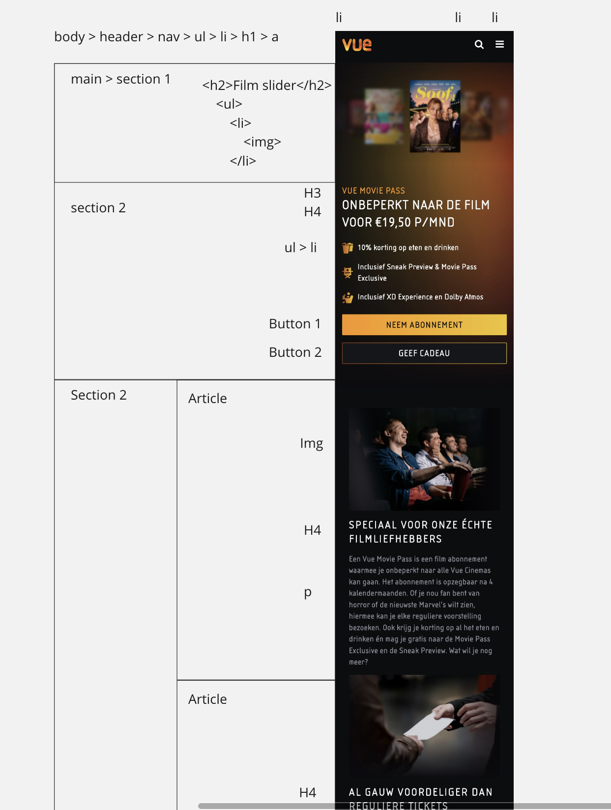
  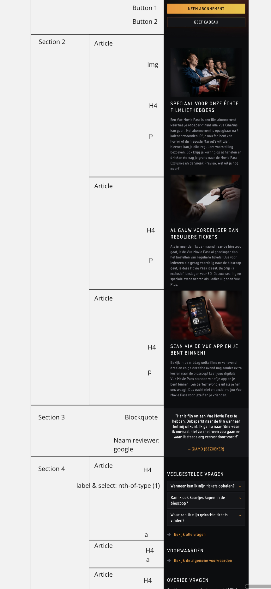
  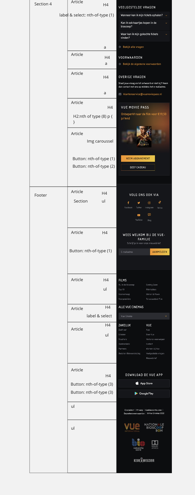

  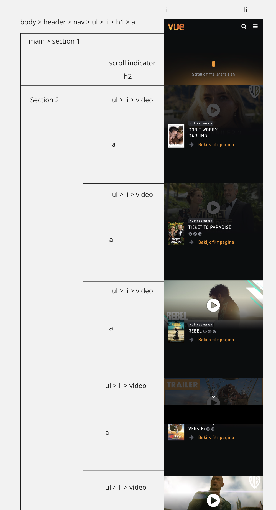
  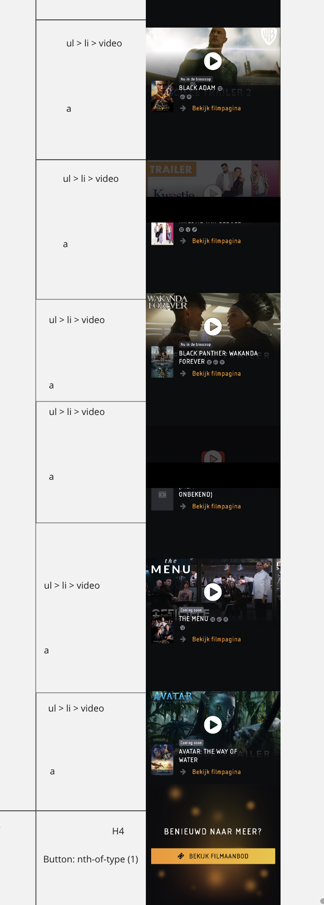
  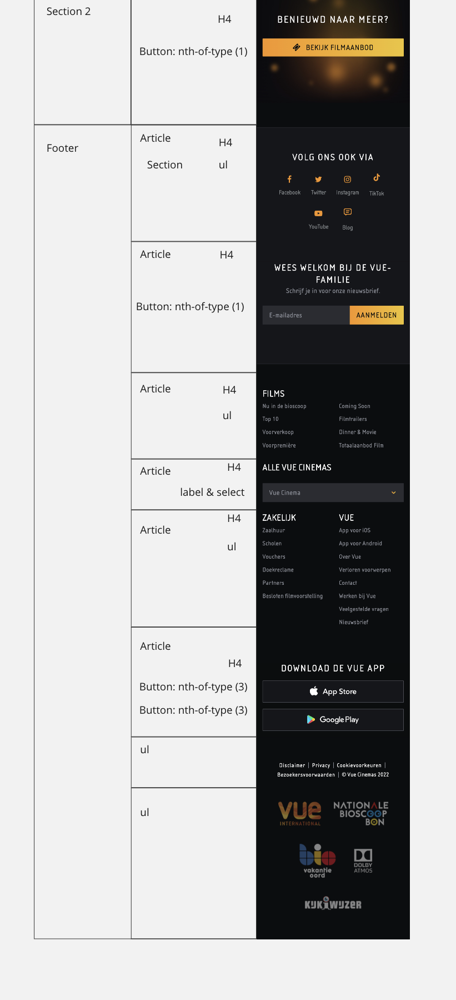

  ### dynamisch deel (bijv menu): 
  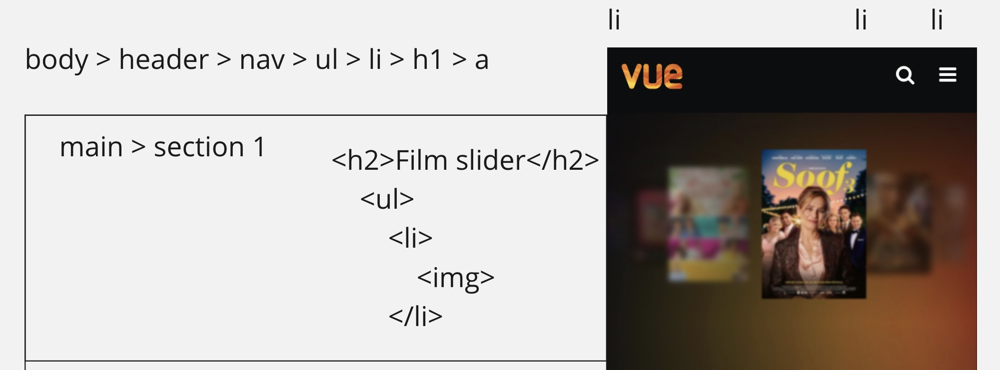

## Voortgang 1 (week 2)

  
uitwerken voor 1e voortgang

  ### Stand van zaken
  hier dit ging goed & dit was lastig (neem ook screenshots op van delen van je website en code)

  Wat goed ging: 
  Pagina van de moviepass grotendeels opzetten in html en css:
  
  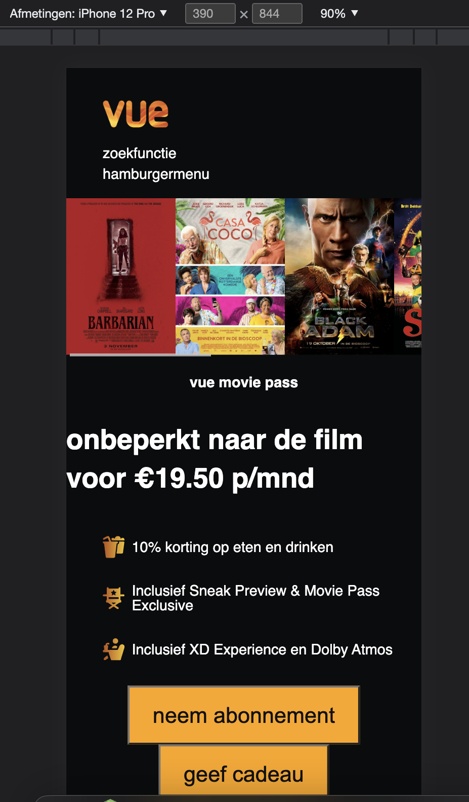

  Wat lastig is:
  Juiste CSS uitzoeken: grid, flexbox enz

  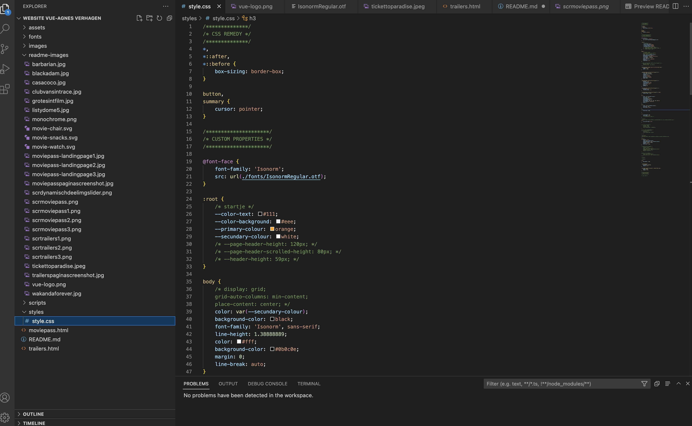

  ### Agenda voor meeting
  samen met je groepje opstellen

  Student 1: Agnes

  Ik zoek een alternatief voor de class in de body. Ook wil ik weten wat h1 en h2 enz zijn. Zijn mijn breakdownschetsen goed? 

  
  Student 2: Ab

  Geswitcht naar nieuwe website, omdat de eerste teveel gebruik maakte van animaties, te lastig om te maken. Lastig om classes en divs te vervangen door iets anders.

  Student 3: Koelsoem

  Heeft nu alleen html main met afb en kopjes in flex, moet alleen nog uitzoeken hoe er goede marges moeten komen. Ook moet ze nog werken aan header en footer.

  
  Student 4: Sohil

  Heeft niet gereageerd

  ### Verslag van meeting
  hier na afloop snel de uitkomsten van de meeting vastleggen

  Ab moet nog het meeste doen voor de html en de css. Koelsoem moet koppen toevoegen en ook de rest van de content van de website aanvullen en ook meer css toevoegen. Ik zelf kreeg als tip om 3 css bestanden aan te maken: 1 voor het algemene deel en dan 1 voor elke pagina. In een html bestand van 1 specifieke pagina zou ik dan moeten linken naar de algemene stylesheet en naar de specifieke. Ook kon ik het beste op de homepagina alleen een h1 zetten en niet een a, want daar is het logo geen link naar de homepage, omdat het logo zich al op de homepage bevindt. Ook kon ik nog de slider van films klikbaar maken en ook met een stopoptie. 

## Voortgang 2 (week 3)

  
uitwerken voor 2e voortgang

  ### Stand van zaken
  hier dit ging goed & dit was lastig (neem ook screenshots op van delen van je website en code)

  Wat goed ging was om 3 verschillende css bestanden te maken. Ook met het selecteren van bepaalde onderdelen in een sectie kon ik bepaalde eigenschappen geven aan een specifiek deel, zoals de kleur van een lettertype. Ik was blij dat dit lukte zonder een class te hoeven gebruiken.

  ### Agenda voor meeting
  samen met je groepje opstellen

  Student 1: Agnes

  Wat wel al goed ging;
   -Nav bar maken
   -JS gebruiken om knop blauw te maken

  Wat nog niet lukt;
   -Hamburgermenu lukt niet
   -Logo moet naar links en omhoog: lukt niet
   -Lineheight:lukt niet
   -Gradient: moet over 3 secties, zonder margins, als 1 verloop, ook moet de gradient rechts beginnen
   -Eigenschappen h1 van moviepass overschrijft eigenschappen van de h1 van trailerpagina (zoals wordspacing en text-transform:uppercase)
 

  
  Student 2: Ab

  Burger bar

  Student 3: Koelsoem

  Responsive maken header

  
  
  Student 4: Sohil

  Header fixen

  ### Verslag van meeting
  hier na afloop snel de uitkomsten van de meeting vastleggen

  Ik werd geholpen bij mijn hamburgermenu. Ik moest de button om het hamburgermenu te sluiten in mijn navigatie doen en de hamburgerknop zelf boven de nav. 

  Verder kreeg ik als tip om alleen padding te gebruiken voor mijn sections en geen margin. Op die manier zou ik een vloeiende gradient kunnen maken als achtergrondd voor mijn sections. Ook kreeg ik nog de tip om alles in mijn code commentaar te geven met hele specifeke namen, zodat iedereen precies zou snappen wat wat was.

## Toegankelijkheidstest 2/2 (week 4)

  
uitwerken na test in 8e werkgroep

  ### Bevindingen
  Lijst met je bevindingen die in de test naar voren kwamen (geef ook aan wat er verbeterd is):

  Toegankelijkheidstest: 2

  Website: Vuecinemas

  Door: Lynn Wolters

  Voor: Agnes Verhagen

  #### Screenreader
  Hier korte omschrijving (met indien nodig afbeeldingen)

  Screenreader Test

  Links
  Bij oplezen films zegt hij ook: bezocht, link, afbeelding
  
  Koppen
  Doet het goed
  
  Formulierregelaars
  Pakt elementen die geen formulieren zijn (zoals pijltjes naar beneden en hamburger menu)
  
  Oriëntatiepunten
  Orientatiepunten doen het niet goed, laten je nauwelijks weten waar je bent op de website
  
  Navigatie
  Navigatie is ook onduidelijk, kan zijn omdat er geen duidelijke navigatie in de website zit
  
  Tekens
  Werken ook niet

  Woorden
  Leest niks op, blijft bij banner hangen

  Vensterspots
  Pakt alleen de hele html als vensterspot

  Hier een omschrijving van hoe het opgelost kan worden (met indien nodig afbeeldingen)
  Kijken of de navigatie verbeterd kan worden

  #### Muis en Toetsenbord 
  Hier korte omschrijving (met indien nodig afbeeldingen)

  Muis
  Footer links moeten nog hover functie krijgen. De twee call to action buttons zou ik de effecten geven die je ook op de website ziet
  
  Toetsenbord
  Gaat prima

  Enter 
  Werkt niet
  Omhoog en omlaag button werken wel om te navigeren
  Tab button werkt om te navigeren maar is moeilijk zichtbaar
  
  Kleuren
  Platte tekst is moeilijk zichtbaar, andere kleur geven

  Hier een omschrijving van hoe het opgelost kan worden (met indien nodig afbeeldingen)
  Footer links hover functie geven, dus bijv met kleuren, buttons bovenin moviepasspagina dezelfde soort hovereffecten geven als de originele site, werk focus optie meer uit, platte tekst meer zichtbare kleur geven.

  #### Motoriek (shocks, elastiekjes)
  Hier korte omschrijving (met indien nodig afbeeldingen)

  Spieren Apparaat
  Knopjes zijn te klein om nog op de kleine knoppen te drukken (knoppen groter maken)

  Concentratie test
  Het is lastig om op de hamburger menu te klikken en de sluit button (zijn erg klein)
  Buttons zijn te dun om er op te klikken

  Hier een omschrijving van hoe het opgelost kan worden (met indien nodig afbeeldingen)
  Knoppen groter maken, hamburgermenu en sluitknop groter maken 

  #### Visueel (brillen, contrast, kleurenblind, dark/light). 
  Hier korte omschrijving (met indien nodig afbeeldingen)

  Brillen

  Hemifield Loss: website is nog goed te zien
  Color #0779P:  website is nog goed te zien
  Peripheral Field Loss: website is heel lastig te zien door donkere kleuren en kleine elementen
  Central Field Loss: website is nog goed te zien
  Low Contrast #0778P: website is nog wel te zien
  Combined Loss Diabetic Disease: website is nog wel te zien maar wordt moeilijk

  Hier een omschrijving van hoe het opgelost kan worden (met indien nodig afbeeldingen)
  Maak kleine elementen groter en zorg voor beter kleurcontrast
  

## Voortgang 3 (week 4)

  
uitwerken voor 3e voortgang

  ### Stand van zaken
  hier dit ging goed & dit was lastig (neem ook screenshots op van delen van je website en code)

  ### Agenda voor meeting
  samen met je groepje opstellen

  Student 1: Agnes

  Wat wel al goed ging;

  Hamburgermenu, dropdown, stijlen
   

  Wat nog niet lukt;
  Wrap van rijen, dingen uitlijnen, zoals de emailbutton
 
  
  Student 2: Ab
  
  Is ziek.

  Student 3: Koelsoem

  Wat goed ging. 
  Ik heb nieuwe css bestanden aangemaakt en gekoppeld, mijn footer responsive gemaakt en begonnen aan mn detail pagina.

  Wat niet goed ging.
  Tekst over een afbeelding zetten op een bepaalde plek.

  Student 4: Sohil

  Ik heb nog steeds moeite met mijn header en mijn github.

  ### Verslag van meeting
  hier na afloop snel de uitkomsten van de meeting vastleggen
  Koelsoem kreeg het advies om een hamburgermenu te maken, want op mobiel scherm werden de navigaitielinks in de header te klein om te lezen. Sohil kreeg te zien hoe hij een navigatiebalk kon maken die 1 kleur had als je de pagina opende en als je begon te scrollen werd de onderste helft van de nav bar transparant. Ik kreeg de tip om de emailbutton en de aanmeldknop in 1 form tag te zetten en toen kon ik hem wel gemakkelijk in het midden van de pagina uitlijnen.

## Eindgesprek (week 5)

  
uitwerken voor eindgesprek

  ### Je uitkomst - karakteristiek screenshots:

  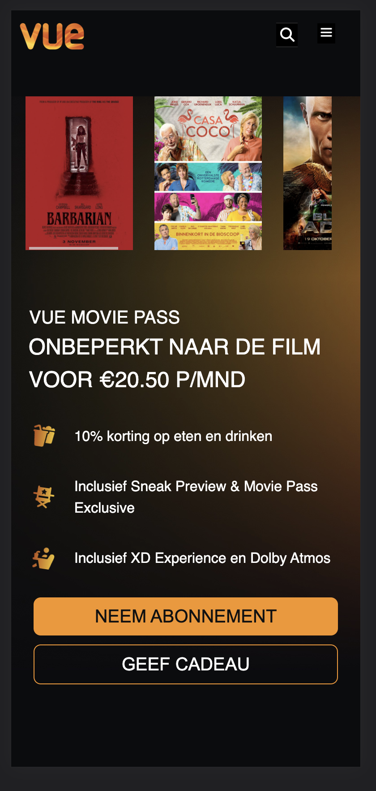
  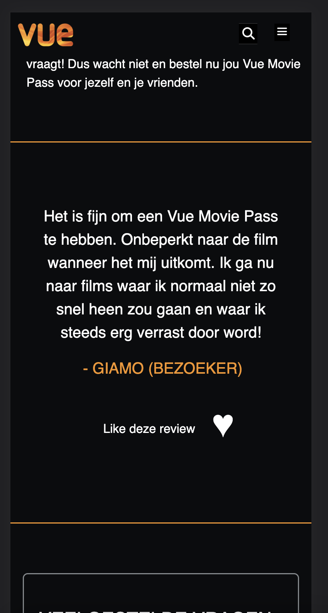
  

  ### Dit ging goed/Heb ik geleerd: 
  Korte omschrijving met plaatjes

  -Custom properties
  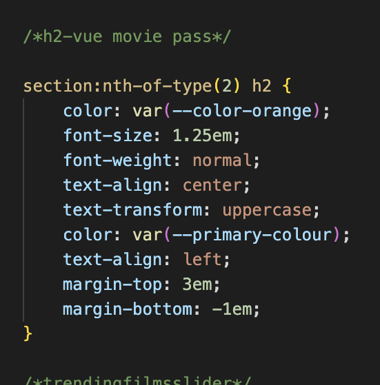

  -Meeste problemen kon ik ontdekken met de inspector
  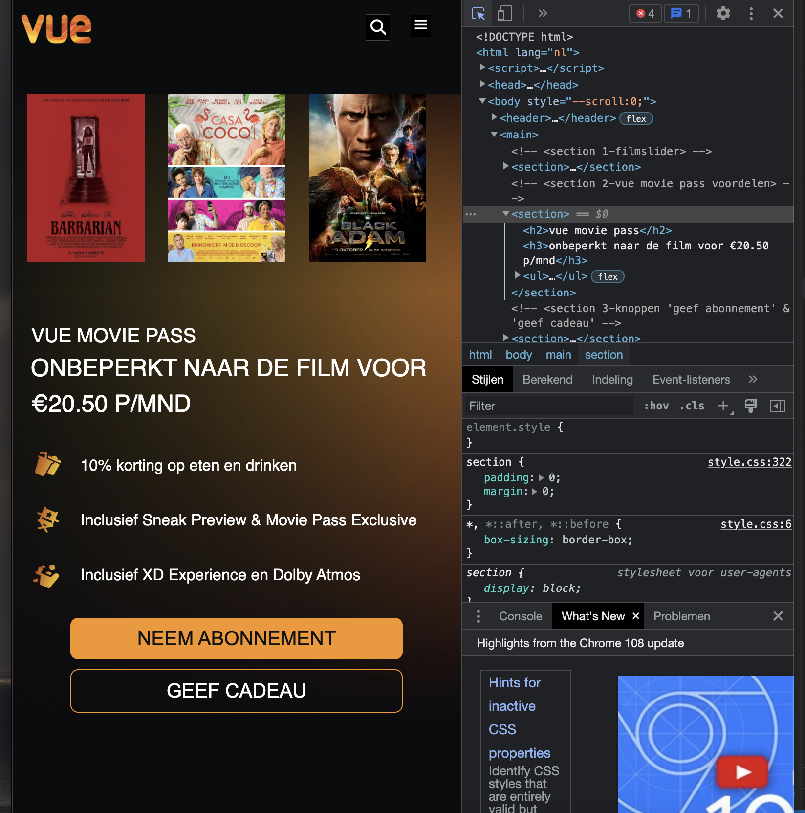

  ### Dit was lastig/Is niet gelukt:
  Korte omschrijving met plaatjes

  Ik vond het nog lastig om goede namen te geven aan de custom properties.

  -Mediaqueries ben ik nog niet helemaal uitgekomen/aan toe gekomen
  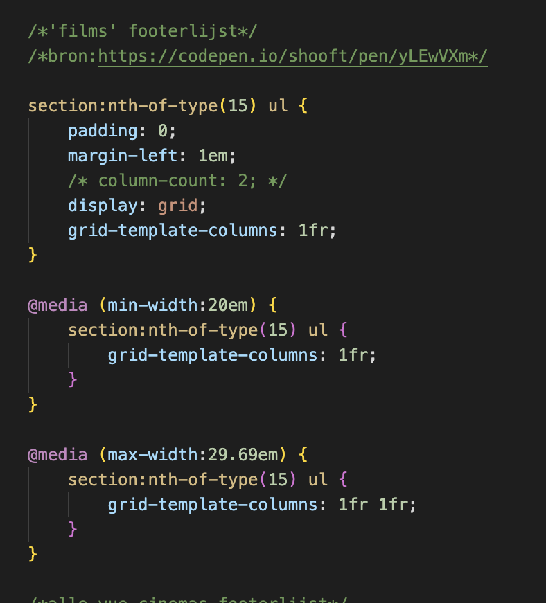

## Herkansing (week 5)

  
uitwerken voor herkansing

  ### Je uitkomst - karakteristiek screenshots:

  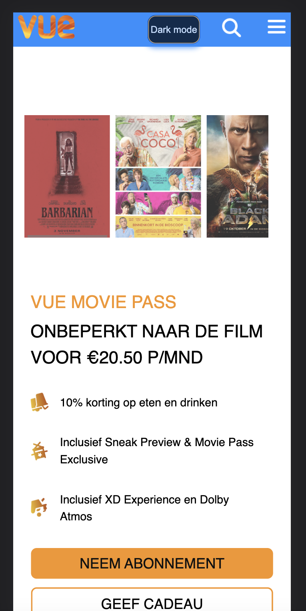

  ### Dit ging goed/Heb ik geleerd: 
  Korte omschrijving met plaatjes

  Ik heb de hele site meer responsive gemaakt, zie hieronder:

  Ook heb ik veel meer gebruik gemaakt van de custom properties. Ik heb een light-darkmode knop gemaakt en de kleuren van de site op elke modus afgestemd, mbv de custom properties. 

  -Custom properties
  

  -Meeste problemen kon ik ontdekken met de inspector
  

  ### Dit was lastig/Is niet gelukt:
  Korte omschrijving met plaatjes

  Ik vind het nog lastig om de custom properties de juiste namen te geven, dus hier en daar kan het verwarrend overkomen.Uit 

## Bronnenlijst

  
continu bijhouden terwijl je werkt

  Nb. Wees specifiek ('css-tricks' als bron is bijv. niet specifiek genoeg).

  1. bron 1: https://www.w3schools.com/tags/tag_select.asp

https://developer.mozilla.org/en-US/docs/Web/CSS/animation-timing-function*/

https://css-tricks.com/a-complete-guide-to-calc-in-css/*/

https://www.javatpoint.com/how-to-center-a-button-in-css

https://codepen.io/shooft/pen/BarqVdR*/

https://www.w3schools.com/howto/howto_css_list_without_bullets.asp */

https://developer.mozilla.org/en-US/docs/Web/HTML/Element/input/email*/

https://developer.mozilla.org/en-US/docs/Web/CSS/box-shadow*/

https://stackoverflow.com/questions/8287447/create-a-white-rgba-css3*/

https://www.w3.org/TR/css-multicol-1/*/

https://codepen.io/shooft/pen/yLEwVXm*/

https://www.handleidinghtml.nl/css/eigenschappen/white-space/beschrijving.html*/

https://stackoverflow.com/questions/25125793/

html-css-display-text-and-wrap-it-propertly-in-two-columns-and-a-single-row*/

https://developer.mozilla.org/en-US/docs/Web/CSS/Media_Queries/Using_media_queries*/

https://kinsta.com/nl/blog/responsive-webdesign/*/

https://www.flaticon.com/free-icon/apple_226769

bron:https://fsymbols.com/copyright/

bron:https://developer.mozilla.org/en-US/docs/Web/HTML/Element/details-->

bron https://codepen.io/Agnes-Verhagen/pen/mdKGxpM -->

bron:https://codepen.io/ahmadbassamemran/pen/rNjMXqg -->

https://www.freecodecamp.org/news/span-html-how-to-use-the-span-tag-with-css/-->
bron:https://www.w3schools.com/html/html_quotation_elements.asp -->

https://developer.mozilla.org/en-US/docs/Web/CSS/scroll-snap-type-->
bron:https://codepen.io/simevidas/pen/PJMENp-->
		

<https://developer.mozilla.org/en-US/docs/Web/HTML/Element/video> -->
						<!-- <https://www.w3schools.com/html/html5_video.asp> -->
						<!-- <https://yt5s.io/en1/youtube-to-mp4> -->

/*lists*/
/*bron: https://www.w3schools.com/howto/howto_css_list_without_bullets.asp */
/*lijstvan trailers*/

/*bron:https://codepen.io/Agnes-Verhagen/pen/NWBNzyY*/

/*bron:https://www.handleidinghtml.nl/css/eigenschappen/white-space/beschrijving.html*/
/*bron:https://stackoverflow.com/questions/25125793/html-css-display-text-and-wrap-it-propertly-in-two-columns-and-a-single-row*/

/*bron:https://codepen.io/shooft/pen/BarqVdR*/

